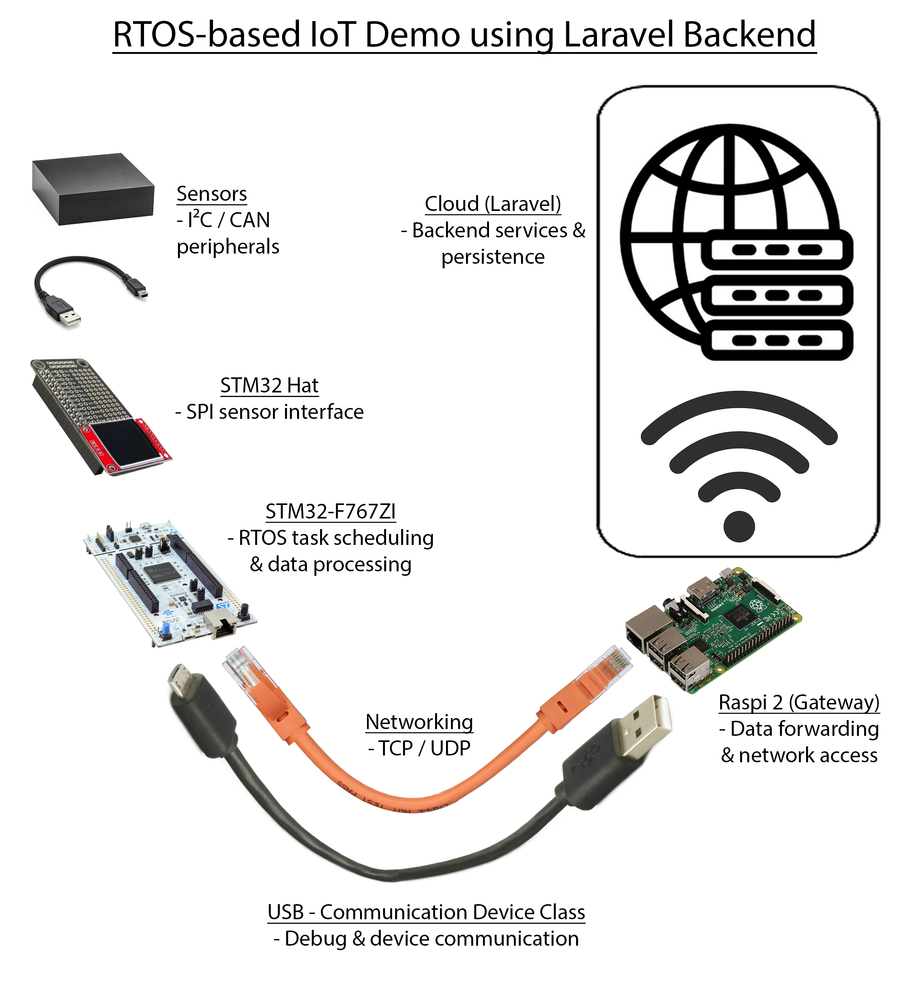

# Embedded Backend Bridge – STM32, ESP32, Raspberry Pi & Laravel

## Project Overview
This project is a **full embedded-to-backend demonstration system** to demonstrate an IoT device.
It combines **low-level embedded development**, **industrial communication buses**, a **Linux-based gateway**,
and a modern **web backend (Laravel)** into one coherent architecture.

The goal is to demonstrate real-world engineering skills across the full stack:
- Embedded systems development (STM32, ESP32)
- Industrial communication protocols (CAN, I2C, SPI, USB, Ethernet)
- Gateway and edge-device architecture (Raspberry Pi)
- Backend development and data visualization (Laravel)

## System Architecture

---

## Hardware Setup

### Central Controller
- **STM32 NUCLEO-F767ZI**
  - Main system controller
  - Central data aggregator and communication hub (selfmade STM32 Hat)
  - Ethernet using LwIP TCP/IP stack
  - USB CDC (virtual serial interface)
  - SPI TFT display
  - I2C master
  - CAN controller

### Slave Devices
- **ESP32 #1 (CAN Slave)**
  - Communication via CAN bus
  - CAN transceiver: VP230
  - Internal I2C light sensor (Adafruit TSL2591)

- **ESP32 #2 (I2C Slave)**
  - Communication via I2C
  - Connected analog temperature sensor (2-pin motherboard-style sensor) 

### Gateway
- **Raspberry Pi 2**
  - Ethernet connection to STM32
  - Wi-Fi connection to a router
  - Forwards collected sensor data to the backend system

---

## Interfaces & Communication

### LAN (Ethernet)
- STM32 ↔ Raspberry Pi
- TCP and UDP communication using LwIP
- STM32 acts as an embedded network device

### USB CDC
- STM32 ↔ Raspberry Pi
- Debugging, logging, and manual data access using builtin CLI

### SPI
- STM32 ↔ Selfmade STM32 Hat
- 1.8" SPI TFT display with SD card slot ("Red Display")
- Local visualization of system status and sensor values

### CAN Bus
- STM32 ↔ ESP32 slave
- VP230 CAN transceiver
- Transmission of light sensor data

### I2C
- STM32 ↔ ESP32 slave
- Transmission of temperature sensor data

---

## Electrical Schematic

---

## Software Architecture

### Embedded (STM32)
- STM32CubeMX / HAL
- LwIP TCP/IP stack
- USB Device (CDC)
- CAN, I2C, SPI drivers
- TFT display driver
- Central data collection and aggregation logic

### ESP32 Slaves
- Arduino Studio
- Sensor integration
- Protocol-compliant communication (CAN / I2C)

### Gateway (Raspberry Pi)
- Linux-based data gateway
- Receives data from STM32 via Ethernet or USB
- Forwards structured data to the backend

### Backend (Laravel)
- Standalone Laravel project
- Authentication and authorization
- REST API
- Dashboard visualization:
  - Temperature data (CAN slave)
  - Light data (I2C slave)
- Clear separation between embedded and web layers

---

## Project Goals (Portfolio Focus)

This project demonstrates:
- Professional embedded system design
- Multi-bus communication handling
- Edge-to-backend gateway architectures
- Backend communication to a Laravel backend
- Clean separation of concerns
- System-level thinking from hardware to web UI

Well suited as a **reference project for Embedded, IoT, or Backend engineering roles**.

---

## Status
🚧 Work in progress – focus on laravel communication
